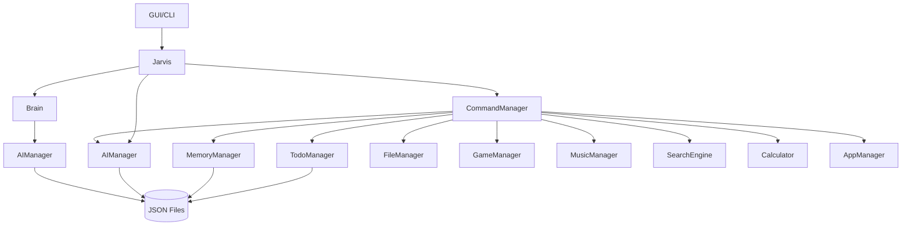

# Jarvis AI Assistant - Architecture Review

## 1 & 2. Project Understanding & Architecture Analysis
I have completely read every file in the project. The project is a desktop AI assistant that uses a local GUI and CLI to interact with the Groq LLM API. It follows a monolithic, loosely layered architecture relying heavily on "Manager" classes. 

## 3. Architecture Explanation
The system is divided into four main layers:
1. **Presentation Layer**: CLI (`main.py`) or GUI (`gui/app.py`).
2. **Orchestration Layer**: The `Jarvis` class (`jarvis.py`) acts as a central facade initializing all subsystems.
3. **Cognitive Layer**: The `Brain` class determines the user's intent, while the `AIManager` handles raw LLM generation and chat history.
4. **Execution Layer**: The `CommandManager` routes intents to specific domain managers (e.g., `TodoManager`, `GameManager`) which handle business logic and interact with the filesystem.

## 4. Dependency Graph


*(Note: There are two instances of `AIManager` created, one in `Jarvis` and one in `Brain`, leading to potential file I/O collisions).*

## 5. Identification of Patterns and Issues

*   **Design Patterns Used**:
    *   **Facade Pattern**: `Jarvis` acts as a unified interface to the complex subsystem of managers.
    *   **Manager/Service Pattern**: Domain-specific logic is encapsulated into separate classes (`TodoManager`, etc.).
*   **Anti-Patterns**:
    *   **God Object**: `CommandManager` knows about every single manager and handles routing for the entire application.
    *   **Arrow Anti-Pattern / Switch Statement**: `CommandManager.process` relies on a massive `if-elif` chain rather than polymorphism.
*   **Code Smells**:
    *   **Dead Code**: The `Planner` class (`planner.py`) is never instantiated. Furthermore, `jarvis.py` currently has the actual execution commented out and only returns the intent string.
    *   **Long Parameter List**: `CommandManager`'s `__init__` takes 9 parameters.
*   **Duplicated Code**:
    *   JSON file reading/writing logic and error handling is duplicated across `TodoManager`, `MemoryManager`, and `AIManager`.
*   **Tight Coupling**:
    *   `Jarvis` hardcodes the instantiation of all its dependencies. Adding a new manager requires changing `Jarvis` and `CommandManager`.
*   **Unnecessary Abstractions**:
    *   `BaseManager` provides no real functionality other than a generic print statement on initialization.
    *   `commands.py` contains scattered global functions that could easily be encapsulated within a relevant manager (like `TimeManager` or `WebManager`).
*   **Missing Abstractions**:
    *   **Command Pattern**: Instead of `if-elif`, commands should be self-contained classes implementing a common `execute()` interface.
    *   **Dependency Injection Container**: To manage the instantiation of all these classes dynamically.
*   **Scalability Issues**:
    *   Adding a new feature requires modifying the `Jarvis` constructor, `CommandManager` constructor, and appending to the massive `if-elif` chain in `CommandManager`.
*   **Maintainability Issues**:
    *   Multiple instances of `AIManager` (in `Jarvis` and `Brain`) will cause race conditions when reading/writing to `chat_history.json`.
*   **Security Issues**:
    *   **CRITICAL**: `calculator.py` uses python's `eval()` on raw user input. This allows arbitrary code execution.

## 6. File Responsibilities

*   **`jarvis.py`**: The central orchestrator. Initializes all modules and provides the `process_command` entry point.
*   **`main.py`**: The Command Line Interface entry point. Loops and accepts user input.
*   **`.env`**: Stores sensitive environment variables (Groq API Key).
*   **`config/logger.py`**: Configures the standard Python logging module.
*   **`config/paths.py`**: Defines absolute paths for the project using `pathlib` and creates necessary directories.
*   **`config/settings.py`**: Loads environment variables and defines global application constants.
*   **`gui/app.py`**: A CustomTkinter application providing a graphical user interface for Jarvis.
*   **`modules/ai_manager.py`**: Manages the Groq LLM client, generates responses, and persists chat history.
*   **`modules/app_manager.py`**: Opens local OS applications (Chrome, Notepad) using `os.startfile`.
*   **`modules/base_manager.py`**: A useless base class meant to provide inheritance for managers.
*   **`modules/brain.py`**: Uses the LLM to classify intent, extract memory key-values, and decide what to remember.
*   **`modules/calculator.py`**: Evaluates mathematical expressions using `eval()`.
*   **`modules/command_manager.py`**: A router that parses the user's raw string command and calls the appropriate manager method.
*   **`modules/commands.py`**: A collection of isolated helper functions for time, date, and opening specific web pages.
*   **`modules/file_manager.py`**: Handles local file creation, deletion, and listing in the current working directory.
*   **`modules/game_manager.py`**: Contains mini-games like dice rolling, coin flipping, and number guessing.
*   **`modules/memory_manager.py`**: Stores and retrieves specific facts in `memory.json`.
*   **`modules/music_manager.py`**: Opens YouTube searches for specific songs.
*   **`modules/planner.py`**: An unused class designed to route AI intents to the `CommandManager`.
*   **`modules/search_engine.py`**: Opens Google searches in the default web browser.
*   **`modules/todo_manager.py`**: Manages a list of tasks and persists them to `tasks.json`.

## 7. Complete Project Tree

```text
jarvis/
├── .env
├── main.py
├── jarvis.py
├── config/
│   ├── __init__.py
│   ├── logger.py
│   ├── paths.py
│   └── settings.py
├── data/
│   (Created at runtime: memory.json, tasks.json, chat_history.json)
├── gui/
│   └── app.py
├── logs/
│   (Created at runtime: jarvis.log)
└── modules/
    ├── ai_manager.py
    ├── app_manager.py
    ├── base_manager.py
    ├── brain.py
    ├── calculator.py
    ├── command_manager.py
    ├── commands.py
    ├── file_manager.py
    ├── game_manager.py
    ├── memory_manager.py
    ├── music_manager.py
    ├── planner.py
    ├── search_engine.py
    └── todo_manager.py
```

## 8. Execution Flow

**Intended Flow vs Actual Flow:**

*   **Intended Flow**: `main.py/app.py` -> `Jarvis.process_command()` -> `Brain.classify()` -> `Planner.execute()` -> `CommandManager` or `AIManager` -> Response.
*   **Actual Flow**: The code is currently disconnected.
    1.  User enters text in `main.py` or `app.py`.
    2.  `Jarvis.process_command(command)` is called.
    3.  `Jarvis` calls `self.brain.classify(command)` which makes an LLM call to classify intent.
    4.  **BREAKPOINT**: `Jarvis` immediately `return intent`. The lines routing to `CommandManager` or `AIManager` are commented out. The `Planner` is completely ignored.
    5.  The UI receives just the intent string (e.g., "COMMAND" or "GENERAL_AI") and prints it to the screen. No command is actually executed.

## 9. External Dependencies
*   `groq`: API client for the LLM.
*   `customtkinter`: For the modern dark-mode GUI.
*   `python-dotenv`: To load variables from `.env`.

## 10. Configuration Files
*   **`.env`**: Holds secure keys, specifically `GROQ_API_KEY`.
*   **`config/settings.py`**: Acts as a configuration registry. Exposes the API key, `DEFAULT_MODEL`, app version, and max chat history length.
*   **`config/paths.py`**: Uses `pathlib` to dynamically resolve the absolute path to the project root, creating the `data/` and `logs/` directories if they do not exist.
*   **`config/logger.py`**: Sets up `logging.basicConfig` to output to `logs/jarvis.log`.

## 11. State Storage
State is persisted to disk in the `data/` directory using JSON formatting:
*   `data/chat_history.json`: Array of message dicts (role, content).
*   `data/tasks.json`: Array of strings representing tasks.
*   `data/memory.json`: Dictionary of key-value string pairs.
*   In-memory state exists during runtime in `GameManager` (for the active guessing game) and the arrays/dicts inside the managers.

## 12. How Memory Works
1.  When a command reaches the end of `CommandManager`, it asks `ai_manager.should_remember(command)` (Note: bug in code, `should_remember` is in `Brain`, not `AIManager`).
2.  If the LLM returns "YES", it calls `ai_manager.extract_memory(command)` (again, this is in `Brain`).
3.  The LLM extracts a key-value JSON pair.
4.  `MemoryManager.remember(key, value)` saves it to the dictionary and rewrites `memory.json`.
5.  On queries ("what is..."), `MemoryManager.recall(key)` is used.

## 13. How AI Conversations Work
The `AIManager` maintains a list of messages (`self.messages`) starting with a system prompt. When `ask(prompt)` is called, the user's prompt is appended. `client.chat.completions.create` is called with the entire history. The assistant's response is appended to the history, and the entire array is dumped to `chat_history.json`.

## 14. How Commands are Executed
The `CommandManager.process()` method acts as a massive string parser. It uses `command.startswith()` or `command ==` to match specific phrases. If it matches, it often uses `command.split()` and string splicing (`" ".join(words[2:])`) to extract arguments, passing them to the relevant manager method.

## 15. How GUI Communicates with Jarvis
`app.py` sets up a Tkinter loop. When the "Send" button is clicked (or Enter is pressed), the text is grabbed from the input field and passed to `self.assistant.process_command(command)`. Because this call runs synchronously on the main thread, the entire GUI freezes while waiting for the Groq API network request to resolve, unfreezing only when the response is inserted into the chatbox.

## 16. Modules to Remain Unchanged
*   **`config/paths.py`**: Excellent use of `pathlib.Path` and automatic directory resolution/creation.
*   **`config/logger.py`**: Standard and clean logging implementation.
*   **`config/settings.py`**: Good separation of configuration variables.

## 17. Architecture Review Ratings

| Module | Rating (1-10) | Justification |
| :--- | :---: | :--- |
| `config/*` | 9 | Clean, standard, and highly reusable. |
| `jarvis.py` | 3 | Currently broken (commented out execution). Tight coupling with 9 dependencies instantiated manually. |
| `gui/app.py` | 4 | Clean UI layout, but synchronous execution blocks the main thread causing freezing. |
| `modules/brain.py` | 6 | Good use of system prompts for extraction, but overlaps responsibilities with `AIManager`. |
| `modules/ai_manager.py` | 5 | Handles Groq well, but instantiating multiple times causes file IO collisions. |
| `modules/command_manager.py` | 2 | God object. Massive `if/elif` chain. String parsing is brittle. Calls methods that don't exist on `AIManager`. |
| `modules/calculator.py` | 1 | Uses `eval()` on raw input. Severe security risk. |
| `modules/planner.py` | 1 | Unused dead code. |
| `Other Managers` | 6 | Functionally they work, but they lack error handling and duplicate JSON persistence logic. |

## 18. Technical Debt Report
*   **High Priority (Security/Bugs)**:
    *   Remove `eval()` in `calculator.py`.
    *   Fix the broken execution flow in `jarvis.py` (uncomment execution logic).
    *   Fix `CommandManager` calling `self.ai_manager.should_remember` (it exists on `Brain`, not `AIManager`).
*   **Medium Priority (Architecture)**:
    *   Remove `planner.py` (dead code) or integrate it properly.
    *   Fix multiple instantiations of `AIManager` to prevent `chat_history.json` corruption.
    *   Refactor `CommandManager` away from `if-elif` to a Command Pattern registry.
*   **Low Priority (Clean Code)**:
    *   Remove `base_manager.py`.
    *   Consolidate JSON read/write logic into a `StorageService`.

## 19. Production Readiness Report
**Status: NOT READY (Prototype Phase)**
The application is currently a prototype. It cannot be shipped in its current state because:
1.  The core functionality is commented out (`jarvis.py`).
2.  The GUI freezes entirely when making network requests.
3.  Severe security vulnerability via `eval()`.
4.  Brittle string parsing means user commands must perfectly match expected structures.

## 20. Roadmap to Production-Grade Assistant

**Phase 1: Stabilization & Security (Immediate)**
*   Fix the `jarvis.py` execution flow.
*   Replace `eval()` in `calculator` with a safe parsing library (e.g., `numexpr` or `ast.literal_eval` for math).
*   Fix the bugs where `CommandManager` calls incorrect methods.
*   Ensure `AIManager` is treated as a Singleton or passed by reference to avoid file locks/overwrites.

**Phase 2: Architectural Refactoring (Short Term)**
*   Implement the **Command Pattern**: Create a base `Command` class. Each action (PlaySong, AddTask) becomes a class.
*   Implement a **Command Registry**: `CommandManager` loops through registered commands to see which one can handle the user input.
*   Create a `StorageService` to handle all JSON file operations, keeping Managers focused on business logic.

**Phase 3: Asynchronous Execution (Medium Term)**
*   Convert Groq API calls to `AsyncGroq`.
*   Implement `asyncio` or threading in `app.py` so the GUI remains responsive while the LLM generates text.

**Phase 4: Agentic Autonomy & Polish (Long Term)**
*   Replace brittle string parsing (`command.startswith("add task")`) with LLM Tool Calling (Function Calling). Let Groq natively decide to call `add_task` with JSON arguments.
*   Implement a robust Planner that can chain multiple tool calls together (e.g., "Search google for weather and save it to my notes").
*   Add unit tests and CI/CD pipelines.
