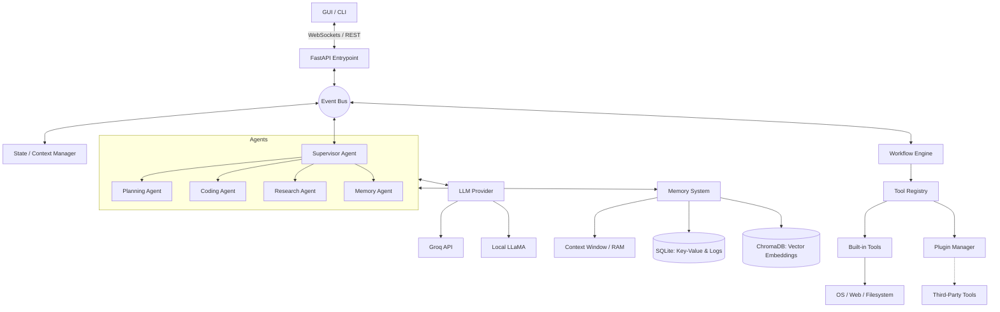

# Jarvis Agentic AI Platform - System Architecture & Implementation Plan

## 1. Architectural Vision
The goal is to transition from a monolithic, tightly coupled prototype to a modern, robust, and extensible **Agentic AI Platform**. We will not preserve the legacy architecture; instead, we will use modern software engineering principles:
*   **SOLID Principles**: Ensuring single responsibilities, open/closed interfaces, and dependency inversion.
*   **Event-Driven Architecture**: Decoupling components using an Event Bus.
*   **Dependency Injection**: Managing component lifecycles and enhancing testability.
*   **Modularity**: High cohesion within modules (memory, tools, agents) and loose coupling between them.

## 2. Core Principles
*   **Separation of Concerns**: UI, business logic, LLM communication, and storage must be strictly isolated.
*   **Extensibility**: The system must support adding new tools, agents, and memory stores without modifying core code (Plugin Architecture).
*   **Testability**: Every component must be unit-testable. LLM calls will be abstracted to allow mocking.

## 3. Project Structure
The repository will be structured to support a large-scale, production-grade application:

```text
jarvis/
├── jarvis/
│   ├── core/               # Base interfaces (BaseTool, BaseAgent, BaseMemory) and common types
│   ├── brain/              # LLM providers (OpenAI, Groq, Anthropic, Local), Prompt Management
│   ├── memory/             # Memory subsystem (Short-term, Vector DB, SQLite, Context Window)
│   ├── agents/             # Specialized agents (Supervisor, Planner, Coder, Researcher)
│   ├── tools/              # Built-in tools (File System, Web Search, Calculator, Browser)
│   ├── workflow/           # Execution engine, DAG processing, Task Queues
│   ├── events/             # Event Bus, Publisher/Subscriber definitions
│   ├── plugins/            # Plugin loader and third-party extension manager
│   ├── storage/            # Database connections and ORM models
│   ├── config/             # Pydantic settings, environment variables, config files
│   ├── telemetry/          # Structured logging, OpenTelemetry tracing, metrics
│   ├── api/                # FastAPI application for headless/server mode
│   ├── cli/                # Command Line Interface (e.g., Typer/Click)
│   └── ui/                 # Desktop Application (e.g., PyQt6, PySide, or Tauri wrapper)
├── tests/
│   ├── unit/
│   ├── integration/
│   └── e2e/
├── plugins/                # Directory for user-installed third-party plugins
├── docker/                 # Dockerfiles and docker-compose configurations
└── pyproject.toml          # Poetry/UV dependency management
```

## 4. Major Components Definition

*   **Event Bus**: The central nervous system. Allows loosely coupled components to broadcast and subscribe to events (e.g., `UserMessageReceived`, `ToolExecutionStarted`, `AgentStateChanged`).
*   **LLM Provider**: An abstraction layer over LLM APIs. Standardizes requests/responses so the system can seamlessly switch between Groq, OpenAI, Claude, or local LLaMA models.
*   **Context Manager**: Assembles the "context window" for the LLM. It continuously gathers active system state (open files, time, recent events) and injects it into prompts.
*   **Tool Registry**: A central dictionary where tools register their schemas (JSON schemas for function calling).
*   **Planner**: A cognitive component that decomposes complex user requests into a Directed Acyclic Graph (DAG) of tool calls and sub-tasks.
*   **Workflow Engine**: Executes the DAG generated by the planner. Handles asynchronous execution, retries on failure, and passes outputs from one tool as inputs to another.
*   **Memory System**: Manages persistence (see section 6). Routes information to the correct storage tier.
*   **Supervisor Agent**: The orchestrator. Receives the user request and determines which specialized agent (e.g., Coding Agent, Research Agent) should handle it.
*   **Plugin Manager**: Discovers, validates, and loads third-party Python modules containing custom tools or agents at runtime.
*   **State Manager**: Maintains the application lifecycle and UI state, ensuring synchronization across the GUI, CLI, and background workers.

## 5. Data Flow Architecture

The system utilizes a reactive, event-driven flow:

1.  **Input**: User (via GUI/CLI/Voice) triggers `UserRequestEvent`.
2.  **Context Building**: `ContextManager` catches the event, fetches recent short-term memory, system state, and active workspace data, creating a `ContextRichRequest`.
3.  **Routing**: The `Supervisor Agent` evaluates the request and assigns it to a specialized agent (e.g., `Planning Agent`).
4.  **Planning**: `Planning Agent` queries the `Tool Registry` for available capabilities, queries the `LLM Provider`, and generates a `WorkflowPlan` (DAG).
5.  **Execution**: The `Workflow Engine` takes the DAG. For each node:
    *   Fires `ToolExecutionStarted`.
    *   Executes the Tool (e.g., `SearchTool`).
    *   Fires `ToolExecutionCompleted` with the result.
6.  **Synthesis**: The `Execution Agent` reviews tool outputs, queries the LLM for a final conversational response or summary.
7.  **Memory Update**: The `Memory System` asynchronously processes the interaction, updating long-term and vector databases.
8.  **Output**: An `AssistantResponseEvent` is broadcasted and rendered by the UI.

## 6. Memory Architecture

Memory is tiered based on persistence and retrieval mechanisms:

*   **Short-Term Memory (Context Window)**: In-memory sliding window of the last *N* messages and current scratchpad variables. Flushed or summarized when the context limit is reached.
*   **Conversation History**: Persistent chronological log (SQLite/PostgreSQL) of all raw interactions. Used to reconstruct past sessions.
*   **Semantic / Vector Memory (ChromaDB / Qdrant)**: Embeddings of past conversations, documentations, and code snippets. Enables semantic search ("recall when we talked about the database schema last month").
*   **Long-Term Key-Value Memory**: Explicit facts learned about the user (preferences, OS, API keys, names). Extracted actively by a background Memory Agent.
*   **Knowledge Base**: A curated, markdown-based local file structure where the agent can write permanent, hierarchical notes and summaries for future reference.

## 7. Tool System

Every capability is a Tool implementing a standard `BaseTool` interface with an asynchronous `execute` method and a Pydantic schema for its arguments. This schema is automatically translated into LLM function-calling JSON.

**Interface Example**:
```python
class BaseTool(ABC):
    name: str
    description: str
    args_schema: Type[BaseModel]

    @abstractmethod
    async def execute(self, **kwargs) -> Any:
        pass
```

**Tool Examples**:
*   `CalculatorTool`: Safe math evaluation (replacing `eval()` with `ast.literal_eval` or `numexpr`).
*   `WebSearchTool`: Integrates with DuckDuckGo or Tavily APIs.
*   `BrowserTool`: Playwright-based headless browser for clicking, scraping, and visual QA.
*   `FileSystemTool`: Read, write, list, and grep files securely within a defined workspace.
*   `ShellTool`: Executes local terminal commands (with user confirmation guardrails).
*   `CalendarTool` / `EmailTool`: API integrations for productivity.

## 8. Planner Design

The Planner uses a multi-step reasoning paradigm (e.g., Plan-and-Solve or ReAct). For complex requests (e.g., "Search Python decorators and save a summary"), it works as follows:

1.  **Decomposition**: The LLM splits the request into a DAG.
    *   *Step 1*: `WebSearchTool(query="Python decorators")`
    *   *Step 2*: `SummarizerAgent(input=Step1.output)`
    *   *Step 3*: `FileSystemTool(action="write", path="decorators.md", content=Step2.output)`
2.  **Workflow Engine**: Executes Step 1. Waits for completion.
3.  **Data Passing**: The engine pipes the output of Step 1 into the input schema of Step 2.
4.  **Resilience**: If Step 1 fails, the Planner is invoked again with the error message to regenerate a fallback plan.

## 9. Multi-Agent System

The system transitions from a single chatbot to a Swarm/Hierarchical multi-agent architecture.
*   **Planning Agent**: Focuses strictly on creating and refining execution plans.
*   **Coding Agent**: Specialized prompt and tools for reading/writing code, running tests, and fixing lint errors.
*   **Research Agent**: Optimized for deep web searches, scraping, and synthesizing large documents.
*   **Execution Agent**: Executes basic, linear tool calls.
*   **Memory Agent**: A background worker that constantly reviews conversation logs to update the Vector Database and Long-Term Key-Value store asynchronously.

**Communication**: Agents communicate exclusively through the Event Bus and a Shared Blackboard (shared memory state), ensuring they remain decoupled.

## 10. Plugin Architecture

Third-party developers can extend Jarvis without touching core code.
*   **Discovery**: The `PluginManager` scans a specific `~/.jarvis/plugins/` directory for packages containing a `manifest.json`.
*   **Registration**: The manifest defines which tools, agents, or memory providers the plugin exports.
*   **Isolation**: Plugins are loaded dynamically using `importlib`. In the future, execution can be sandboxed using WebAssembly (Wasm) or Docker containers for security.

## 11. Configuration System

*   **Pydantic Settings**: Strongly typed configuration.
*   **Layered Loading**: Loads defaults -> `config.yaml` -> `.env` files -> Environment Variables -> CLI arguments.
*   **Dynamic Reloading**: Allows changing models (e.g., Groq to local LLaMA) at runtime without restarting the application.

## 12. Logging and Telemetry

*   **Structured Logging**: Using `structlog` to output JSON logs. Essential for debugging multi-agent asynchronous workflows.
*   **LLM Tracing**: Integrating OpenTelemetry or LangSmith to trace the exact prompt, token usage, latency, and tool calls for every LLM interaction.
*   **Metrics**: Prometheus-compatible endpoints tracking task completion rates, error rates, and API costs.

## 13. Testing Strategy

*   **Unit Tests**: `pytest` for testing individual classes (Tools, Managers).
*   **Mocking**: Use `vcrpy` or `responses` to mock LLM API calls, ensuring tests run offline, fast, and deterministically.
*   **Integration Tests**: Testing the Workflow Engine with real tools (e.g., executing a plan that writes a file and verifies the file exists).
*   **E2E Tests**: Simulating user inputs through the Event Bus and asserting final Assistant responses.

## 14. Deployment Strategy

*   **Desktop**: Packaged using PyInstaller or integrated with Tauri for a cross-platform (Windows/Mac/Linux) native desktop app.
*   **API/Server**: `FastAPI` serves as a headless backend, allowing custom frontends (e.g., a web interface) to connect via REST/WebSockets.
*   **CLI**: A rich terminal interface using `Textual` or `Rich` for developers.
*   **Docker**: A fully containerized `docker-compose` setup bundling the app, Vector DB (Chroma), and Relational DB (Postgres) for easy self-hosting.

## 15. Production Architecture Diagram



## 16. Implementation Roadmap

This roadmap is sequenced to build foundational, unblocked components first, gradually layering complexity.

### Phase 1: Foundation & Scaffolding (Milestones 1-10)
1. Initialize project structure (Poetry/UV, directories).
2. Setup basic Pydantic configuration and environment loading.
3. Implement structured logging (`structlog`).
4. Define core base classes (`BaseTool`, `BaseAgent`, `BaseMemory`).
5. Create the central `Event Bus` (Pub/Sub pattern).
6. Implement standard dependency injection container.
7. Set up `pytest` framework and testing guidelines.
8. Create basic CLI entrypoint (`typer` or `click`).
9. Implement generic LLM Provider interface.
10. Integrate Groq API behind the LLM Provider interface with mock tests.

### Phase 2: Tool System & Execution (Milestones 11-20)
11. Build the `ToolRegistry` to register and fetch tools.
12. Implement `CalculatorTool` (safe AST evaluation).
13. Implement `FileSystemTool` (read, write, list dir).
14. Implement `ShellTool` (execute terminal commands).
15. Implement `WebSearchTool` (DuckDuckGo integration).
16. Create JSON schema generator for registered tools (for LLM function calling).
17. Implement synchronous `WorkflowEngine` to execute a single tool from JSON payload.
18. Add error handling and standardized Tool Output formatting.
19. Implement asynchronous support in the `WorkflowEngine`.
20. Add Telemetry/Tracing for tool execution times.

### Phase 3: Basic Memory System (Milestones 21-30)
21. Implement `ShortTermMemory` (in-memory sliding window).
22. Set up SQLite database connection and ORM (SQLAlchemy).
23. Implement `ConversationHistory` storage (saving raw turns).
24. Implement Long-Term Key-Value store in SQLite.
25. Set up local ChromaDB/Qdrant connection for Vectors.
26. Integrate an embedding model (e.g., local SentenceTransformers or API).
27. Implement Semantic Memory storage and retrieval.
28. Create `ContextManager` to merge short-term and retrieved semantic memory.
29. Implement workspace awareness (reading active directories/files into context).
30. Write integration tests for memory retrieval accuracy.

### Phase 4: Planning & Single Agent (Milestones 31-40)
31. Implement `ExecutionAgent` (simple prompt -> function call -> response loop).
32. Define DAG data structures for execution plans.
33. Implement basic `Planner` (LLM generates DAG from prompt).
34. Update `WorkflowEngine` to traverse and execute DAGs.
35. Implement data piping (passing Output of Node A to Input of Node B).
36. Add Planner fallback mechanisms (retry on tool failure).
37. Connect CLI to `ExecutionAgent` for end-to-end testing.
38. Create system prompts for planner guidelines.
39. Implement human-in-the-loop permission prompts for dangerous tools (e.g., Shell).
40. Stabilize single-agent ReAct loop.

### Phase 5: Multi-Agent Swarm (Milestones 41-55)
41. Implement `SupervisorAgent` for intent classification and routing.
42. Implement `ResearchAgent` (specialized in browsing and summarizing).
43. Implement `BrowserTool` (headless Playwright integration).
44. Implement `CodingAgent` (specialized in file modification and linting).
45. Create Shared Blackboard for inter-agent memory sharing.
46. Implement agent-to-agent delegation logic.
47. Implement `MemoryAgent` (background task to summarize logs and update Vector DB).
48. Connect Event Bus to monitor inter-agent communication.
49. Tune prompts for distinct agent personalities/roles.
50. Write multi-agent E2E scenario tests.
51. Implement streaming responses from LLM through Event Bus.
52. Support interrupting/cancelling long-running agent workflows.
53. Implement context summarization to prevent token limit exhaustion.
54. Add local LLaMA/Ollama support to LLM Provider.
55. Add OpenAI/Anthropic support to LLM Provider.

### Phase 6: Extensibility & UI (Milestones 56-75)
56. Define `manifest.json` schema for Plugins.
57. Implement `PluginManager` dynamic loading via `importlib`.
58. Create an example "Spotify Plugin" to test architecture.
59. Implement sandboxing/security checks for loaded plugins.
60. Setup FastAPI application server.
61. Create REST endpoints for chatting and fetching history.
62. Create WebSocket endpoints for real-time streaming events.
63. Initialize Desktop UI project (PyQt6 or Web-based Tauri).
64. Implement UI Chat Interface.
65. Implement UI settings page (API keys, model selection).
66. Implement UI memory viewer (viewing what the agent knows).
67. Connect UI to FastAPI backend via WebSockets.
68. Add markdown and syntax highlighting to UI.
69. Add visual indicators for Tool Execution in the UI (e.g., "Searching web...").
70. Add voice input/output integration (Speech-to-Text / TTS engines).
71. Package Desktop App for Windows/Mac (PyInstaller).
72. Create Dockerfiles for Headless API deployment.
73. Create docker-compose for full stack (App + Chroma + Postgres).
74. Setup CI/CD pipeline (GitHub Actions).
75. Final end-to-end production readiness QA.
